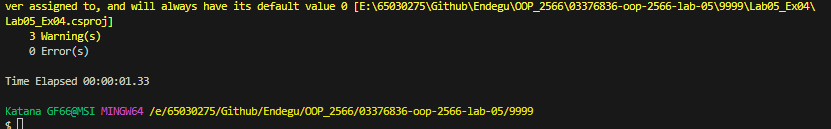
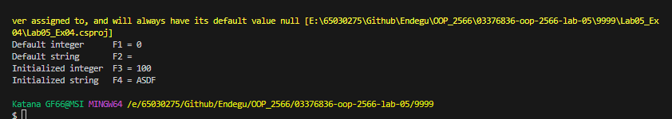

      
   

F1 และ F2 ไม่ได้มีการกำหนดค่าเริ่มต้นในการประกาศคลาส MyClass ดังนั้นจะถือว่ามีค่าเริ่มต้นเป็น 0 สำหรับ int และ null สำหรับ string ตามลำดับ

F3 และ F4 มีการกำหนดค่าเริ่มต้นในการประกาศคลาส MyClass โดย F3 มีค่าเป็น 100 และ F4 มีค่าเป็น "ASDF"