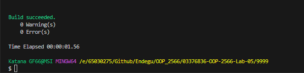
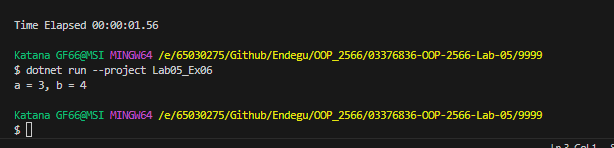

โค้ดด้านบนสร้างอ็อบเจกต์ของคลาส MyClass และเรียกใช้เมธอด DisplayParam ของอ็อบเจกต์ mc โดยส่งค่าพารามิเตอร์ 3 และ 4 เข้าไป ซึ่งจะทำให้เมธอด DisplayParam แสดงผลลัพธ์ทางคอนโซลว่าค่าของ a คือ 3 และค่าของ b คือ 4